# Лабораторна робота 2. Створення складних SQL запитів

## Загальна інформація

**Здобувач освіти:** Лешо Давид Сергійович
**Група:** [32]
**Обраний рівень складності:** [1-2]

## Виконання завдань

### Рівень 1

#### 1. З'єднання таблиць

**Завдання 1.1:** Запит з використанням INNER JOIN для отримання інформації з кількох пов'язаних таблиць

```sql
SELECT p.product_name, c.category_name, p.unit_price
FROM products p
INNER JOIN categories c ON p.category_id = c.category_id;
```

**Результат виконання:**

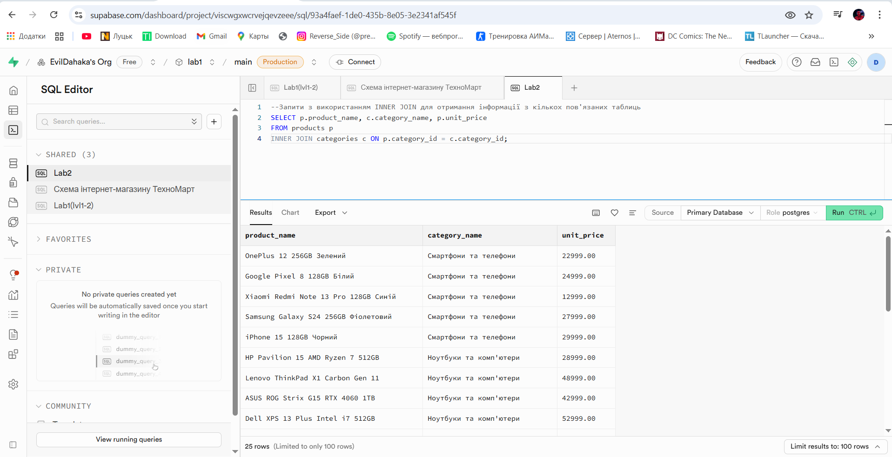

**Пояснення:** Запит отримує назву товару, його категорію та ціну, об’єднуючи таблиці products і categories за category_id


**Завдання 1.2:** Використати LEFT JOIN для включення всіх записів з головної таблиці

```sql
SELECT c.customer_id, c.contact_name, o.order_id, o.order_date
FROM customers c
LEFT JOIN orders o ON c.customer_id = o.customer_id;

```

**Результат виконання:**

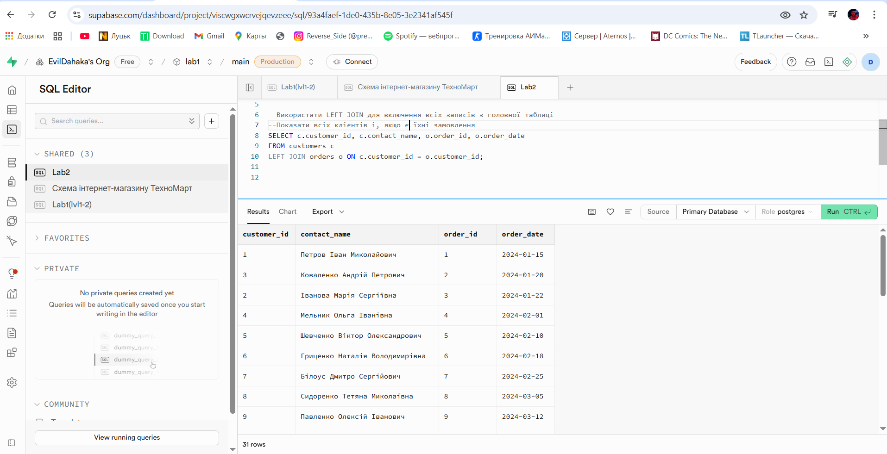

**Пояснення:** INNER JOIN повертає тільки клієнтів з замовленнями, а LEFT JOIN — усіх клієнтів, навіть якщо замовлень немає


**Завдання 1.3:** Створити запит з множинними з'єднаннями (мінімум 3 таблиці)

```sql
SELECT 
    p.product_name, 
    c.category_name, 
    s.company_name AS supplier
FROM products p
INNER JOIN categories c ON p.category_id = c.category_id
INNER JOIN suppliers s ON p.supplier_id = s.supplier_id;

```

**Результат виконання:**

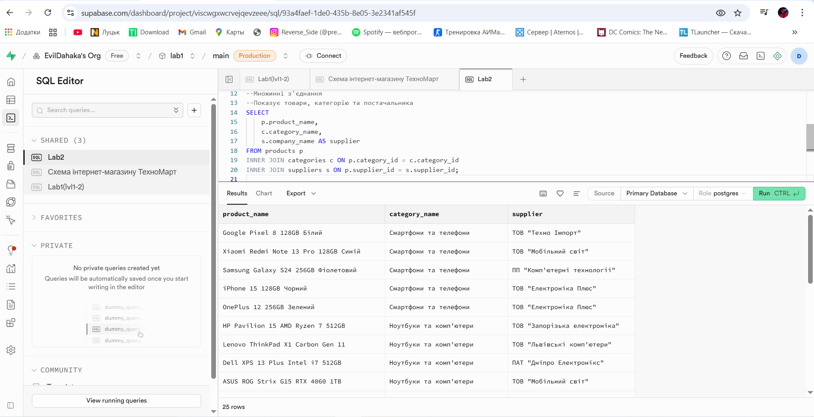

**Аналіз складності:** Запит середньої складності, оскільки виконує дві INNER JOIN одночасно. Спочатку з’єднує products з categories, потім з suppliers. У результаті показує лише ті товари, що мають категорію і постачальника.


#### 2. Агрегатні функції

**Завдання 2.1:** Статистика товарів за категоріями

```sql
-- COUNT, AVG, MIN, MAX по категоріях
SELECT 
    COUNT(*) AS total_products,
    SUM(unit_price) AS total_value,
    AVG(unit_price) AS average_price,
    MIN(unit_price) AS min_price,
    MAX(unit_price) AS max_price
FROM products;

```

**Результат виконання:**

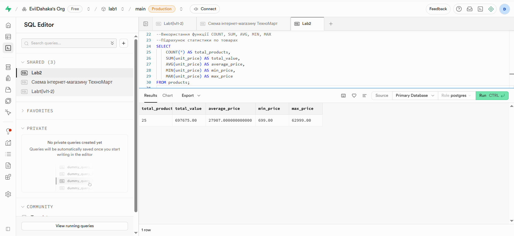


**Завдання 2.2:** Створити запит з GROUP BY для групування даних за різними критеріями

```sql
SELECT c.category_name, COUNT(p.product_id) AS total_products
FROM categories c
INNER JOIN products p ON c.category_id = p.category_id
GROUP BY c.category_name;

```

**Результат виконання:**

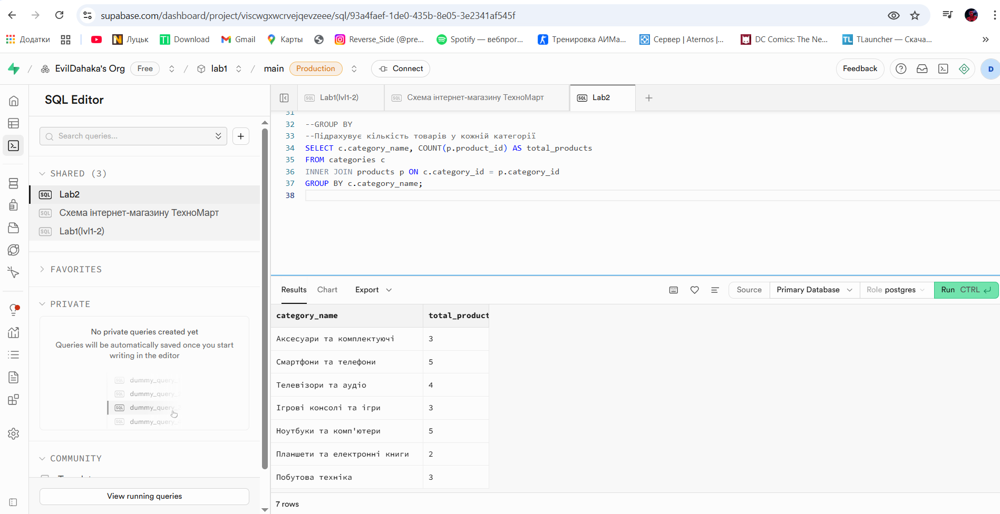


**Завдання 2.3:** Застосувати HAVING для фільтрації груп за умовами

```sql
-- Запит з HAVING
SELECT c.category_name, COUNT(p.product_id) AS total_products
FROM categories c
INNER JOIN products p ON c.category_id = p.category_id
GROUP BY c.category_name
HAVING COUNT(p.product_id) < 4;

```

**Результат виконання:**

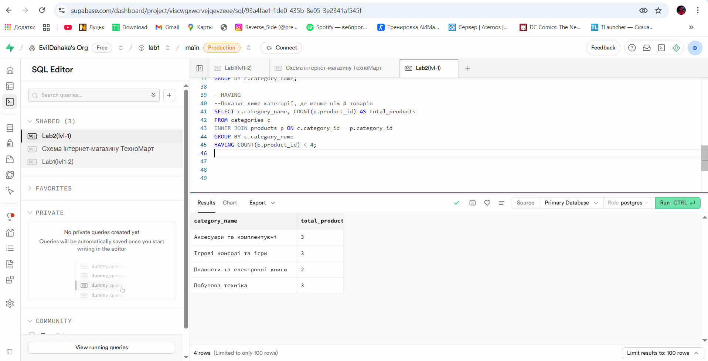


#### 3. Базові підзапити

**Завдання 3.1:** Створити підзапит у розділі WHERE для фільтрації записів

```sql
SELECT product_name, unit_price
FROM products
WHERE unit_price > (SELECT AVG(unit_price) FROM products);

```

**Результат виконання:**
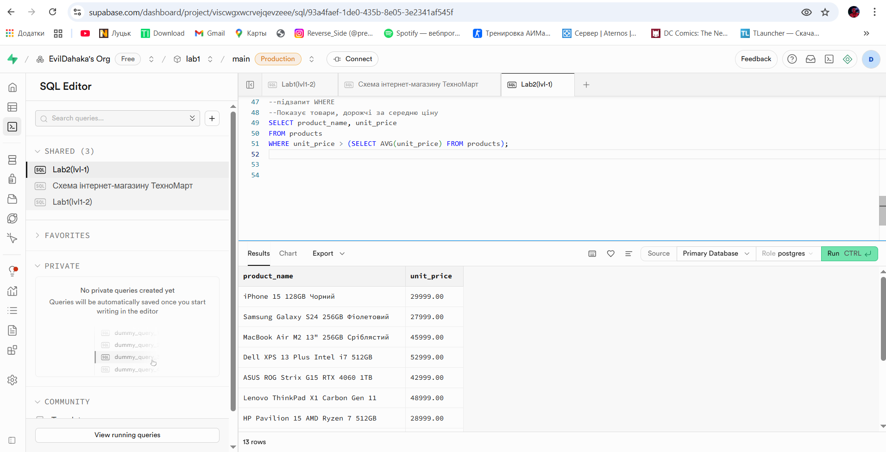


**Завдання 3.2:** Підзапит у SELECT

```sql
SELECT 
    o.order_id,
    (SELECT COUNT(*) FROM order_items oi WHERE oi.order_id = o.order_id) AS total_items
FROM orders o;

```

**Результат виконання:**

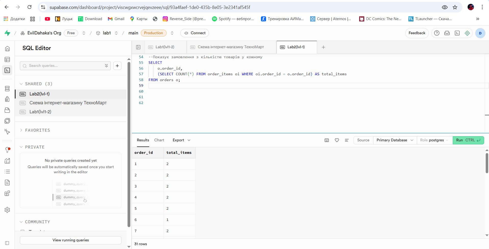


**Завдання 3.3:** Реалізувати запит з використанням операторів IN та EXISTS

```sql
--IN та EXISTS
--Показує клієнтів, які мають замовлення
SELECT * FROM customers
WHERE customer_id IN (SELECT customer_id FROM orders);
--аналогічно через EXISTS
SELECT * FROM customers c
WHERE EXISTS (SELECT 1 FROM orders o WHERE o.customer_id = c.customer_id);
```

**Результат виконання:**

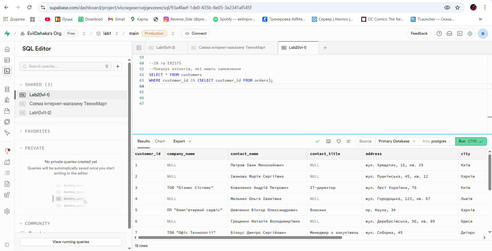 
--аналогічно через EXISTS
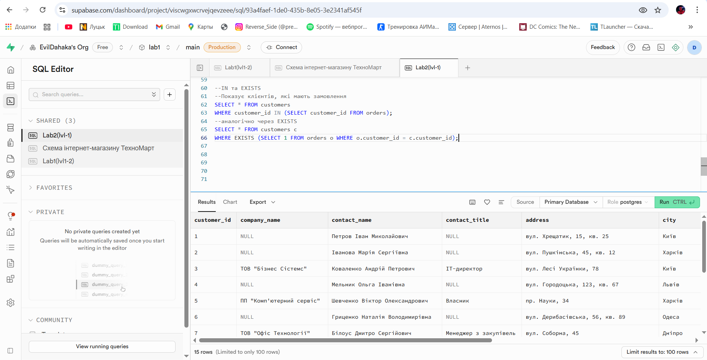 


### Рівень 2

#### 4. Складні з'єднання

**Завдання 4.1:** Створити запит з RIGHT JOIN 

```sql
SELECT 
    s.company_name AS supplier,
    p.product_name
FROM products p
RIGHT JOIN suppliers s ON p.supplier_id = s.supplier_id;
```

**Результат виконання:**

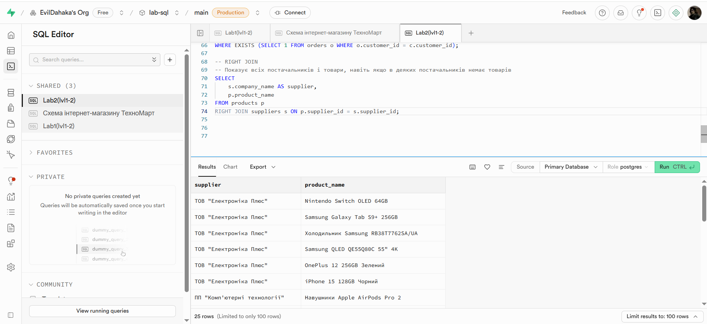 


**Завдання 4.2:** Створити запит з FULL OUTER JOIN

```sql
SELECT 
    p.product_name,
    c.category_name
FROM products p
FULL OUTER JOIN categories c ON p.category_id = c.category_id;

```

**Результат виконання:**
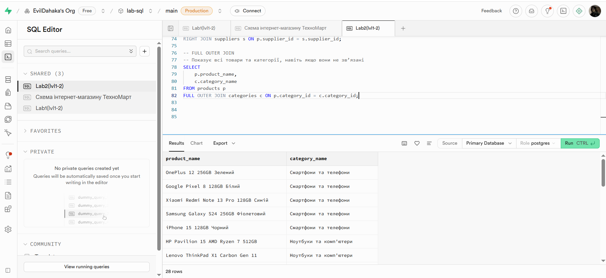 

**Завдання 4.3:** Реалізувати самоз'єднання (self-join) таблиці

```sql
SELECT 
    p1.product_name AS product_1,
    p2.product_name AS product_2,
    p1.unit_price
FROM products p1
INNER JOIN products p2 
    ON p1.unit_price = p2.unit_price 
    AND p1.product_id <> p2.product_id;
```
**Результат виконання:**
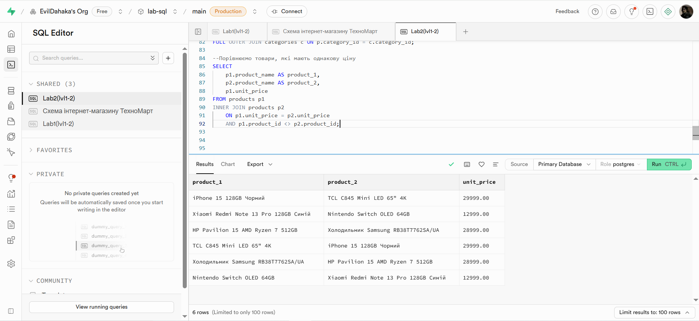 


**Завдання 4.4:** Створити запит з умовним з'єднанням (з додатковими умовами в ON)

```sql
SELECT 
    c.contact_name,
    o.order_id,
    o.order_date
FROM customers c
LEFT JOIN orders o 
    ON c.customer_id = o.customer_id 
    AND c.city = 'Львів';
```
**Результат виконання:**
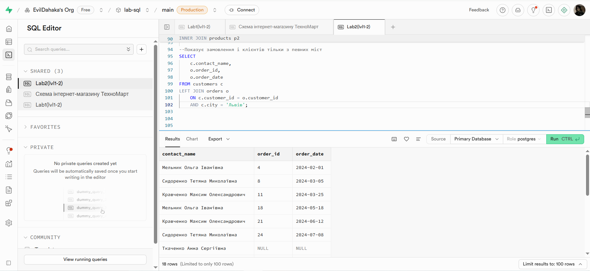 


#### 5. Віконні функції

**Завдання 5.1:** Використати ROW_NUMBER(), RANK(), DENSE_RANK() для ранжування

```sql
SELECT 
    product_name,
    unit_price,
    ROW_NUMBER() OVER (ORDER BY unit_price DESC) AS row_number,
    RANK() OVER (ORDER BY unit_price DESC) AS rank_value,
    DENSE_RANK() OVER (ORDER BY unit_price DESC) AS dense_rank_value
FROM products;

```

**Результат виконання:**
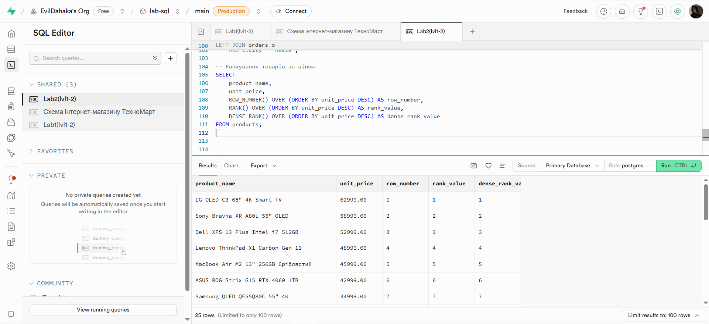 

**Завдання 5.2:** Застосувати LAG(), LEAD() для порівняння з попередніми/наступними записами

```sql
SELECT 
    product_name,
    unit_price,
    LAG(unit_price) OVER (ORDER BY unit_price) AS prev_price,
    LEAD(unit_price) OVER (ORDER BY unit_price) AS next_price
FROM products;
```

**Результат виконання:**
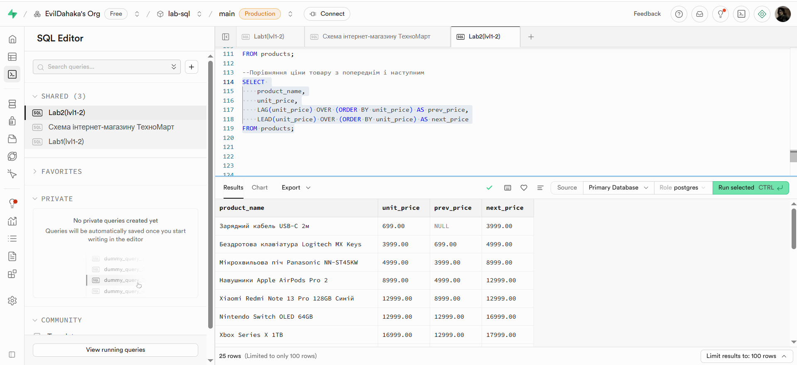 


**Завдання 5.3:** Створити запити з PARTITION BY для аналізу в розрізах

```sql
SELECT 
    category_id,
    product_name,
    unit_price,
    AVG(unit_price) OVER (PARTITION BY category_id) AS avg_price_in_category
FROM products;

```

**Результат виконання:**
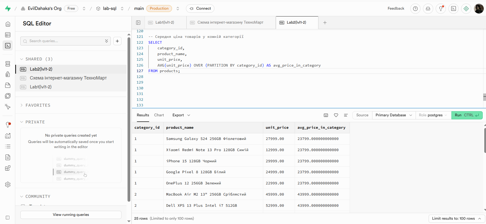 

## Висновки

**Самооцінка**: [4]

**Обгрунтування**: [розібрався]
